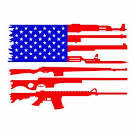

<link rel="stylesheet" href="https://www.w3schools.com/w3css/4/w3.css">

<table >
<tr>
<td></td>
<td style="vertical-align: middle;" class="banner banner0">
    Cost of Gun Violence in America 
</td>
</tr>
</table>
 

  

Challenge Question &nbsp;&nbsp;&nbsp;&nbsp;&nbsp;&nbsp;&nbsp;&nbsp;&nbsp;&nbsp;&nbsp;&nbsp;&nbsp;&nbsp;&nbsp;Choose Your Path &nbsp;&nbsp;&nbsp;&nbsp;&nbsp;&nbsp;&nbsp;&nbsp;&nbsp;&nbsp;&nbsp;&nbsp;&nbsp;&nbsp;&nbsp;Explore Gun Violence by State

 

<table width="1600" height="900" border="0" style="text-align:center;">
<tr>
<td align="middle" colspan="4">
 Choose Your Path for Exploring
 </td>
</tr>
<tr>
<td style="vertical-align:top;text-align:center;">
 <button id="btn1" class="button2" onclick="location.href = 'https://riyazomran.github.io/cs419-narrative-visualization/scene2';">Gun Violence State Death Rate By Year Trend Analysis</button>
 </td>
<td style="vertical-align:top;;text-align:center;"> <button id="btn2" class="button2" onclick="location.href = 'https://riyazomran.github.io/cs419-narrative-visualization/sc3';">Death Count by State Across Different Periods of Time</button>
</td>
</tr>
</table>

