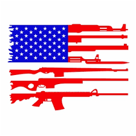
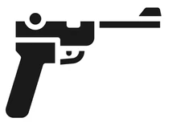

<link rel="stylesheet" href="https://www.w3schools.com/w3css/4/w3.css">

<table>
<tr>
<td></td>
<td style="vertical-align: middle;" class="banner banner0">
    Cost of Gun Violence in America 
</td>
  <!-- <td colspan="3" align="right">Click here to learn more </td> -->
</tr>
</table>

 

We the people of the United States of America must start to recognize the inherant social costs of gun violence and the domino effect repercussions. The US gun homicide rate is 25 times that of other high-income countries. While we can't control random acts of violence, we must aim to learn from them. Take the challenge by clicking the the arrow below!

 

  

Challenge Question &nbsp;&nbsp;&nbsp;&nbsp;&nbsp;&nbsp;&nbsp;&nbsp;&nbsp;&nbsp;&nbsp;&nbsp;&nbsp;&nbsp;&nbsp;Choose Your Path &nbsp;&nbsp;&nbsp;&nbsp;&nbsp;&nbsp;&nbsp;&nbsp;&nbsp;&nbsp;&nbsp;&nbsp;&nbsp;&nbsp;&nbsp;Explore Gun Violence by State

 
    <button id="chooseYourPath" class="button2" onclick="location.href = 'https://riyazomran.github.io/cs419-narrative-visualization/chooseyourpath';">Explore More: Choose Your Path</button>

<!-- QUESTION #1 -->

<table border="0">
<tr>
<td style="vertical-align: top;" width="400px">
 
<b>How many people are shot and killed per day in the United States?</b>
 
 

    
Your answer: &nbsp;&nbsp;&nbsp; 
    0&nbsp;&nbsp;&nbsp;
    <button id="btn1" class="button2" onclick="update(Math.floor(316),'1');" style="display:none;">Lock in my answer!</button>
 
 

 

   <input type="range" min="1" max="1000" value="50" class="slider" id="range1">
 
 
</td>
<td style="vertical-align: top;text-align: center;" >
    <svg id="svg1" width="450" height="300"></svg>
</td>
<td>

 
  When we breakdown the <b>316 daily deaths</b>, we see the extent of the impact of normalizing gun ownership has : 

<ul id="explain1" style="display: none;">
  <li>106 people are shot and killed</li>
  <li>210 survive gunshot injuries</li>
  <li>95 are intentionally shot by someone else and survive</li>
  <li>39 are murdered</li>
  <li>64 die from gun suicide</li>
  <li>10 survive an attempted gun suicide</li>
  <li>1 is killed unintentionally</li>
  <li>90 are shot unintentionally and survive</li>
  <li>1 is killed by legal intervention</li>
  <li>4 are shot by legal intervention and survive</li>
  <li>1 died but the intent was unknown</li>
  <li>12 are shot and survive but the intent was unknown</li>
</ul>
</td>
</tr>
</table>

<table border="0">
<tr>
<td style="vertical-align: top;" width="400px">
 
<b>How many daily gun violence incidents happen that impact children and teens (ages 1-17)?</b>
 
 

    
Your answer: &nbsp;&nbsp;&nbsp; 
    0&nbsp;&nbsp;&nbsp;
    <button id="btn2" class="button2" onclick="update(Math.floor(22),'2');" style="display:none;">Lock in my answer!</button>
 
 

 

   <input type="range" min="1" max="1000" value="50" class="slider" id="range2">
 
 
</td>
<td style="vertical-align: top;text-align: center;" >
    <svg id="svg2" width="450" height="300"></svg>
</td>
<td>

 
  Every day, <b>22 children and teens (1-17)</b> are shot in the United States. Among those: 

<ul id="explain2" style="display: none;">
  <li>5 die from gun violence</li>
  <li>2 are murdered</li>
  <li>17 children and teens survive gunshot injuries</li>
  <li>8 are intentionally shot by someone else and survive</li>
  <li>2 children and teens either die from gun suicide or survive an attempted gun suicide</li>
  <li>8 children and teens are unintentionally shot</li>
</ul>
</td>
</tr>
</table>

<table border="0">
<tr>
<td style="vertical-align: top;" width="400px">
 
<b>On average how many people are shot annually in the United States of America? </b>
 
 

    
Your answer: &nbsp;&nbsp;&nbsp; 
    0&nbsp;&nbsp;&nbsp;
    <button id="btn3" class="button2" onclick="update(Math.floor(115551),'3');" style="display:none;">Lock in my answer!</button>
 
 

 

   <input type="range" min="1" max="200000" value="50" class="slider" id="range3">
 
 
</td>
<td style="vertical-align: top;text-align: center;" >
    <svg id="svg3" width="450" height="800"></svg>
</td>
<td style="vertical-align: top;">
 
  Every year, <b>115,551 people are shot</b>. Among those: 

<ul id="explain3" style="display: none;">
  <li>1,663 children and teens die from gun violence</li>
  <li>864 are murdered</li>
  <li>6,294 children and teens survive gunshot injuries</li>
  <li>2,788 are intentionally shot by someone else and survive</li>
  <li>662 die from gun suicide</li>
  <li>166 survive an attempted gun suicide</li>
  <li>10 are killed by legal intervention</li>
  <li>101 are shot by legal intervention and survive</li>
  <li>89 are killed unintentionally</li>
  <li>38 die but the intent was unknown</li>
  <li>380 are and survive shot but the intent is unknown</li>
</ul>
</td>
</tr>
</table>
 

